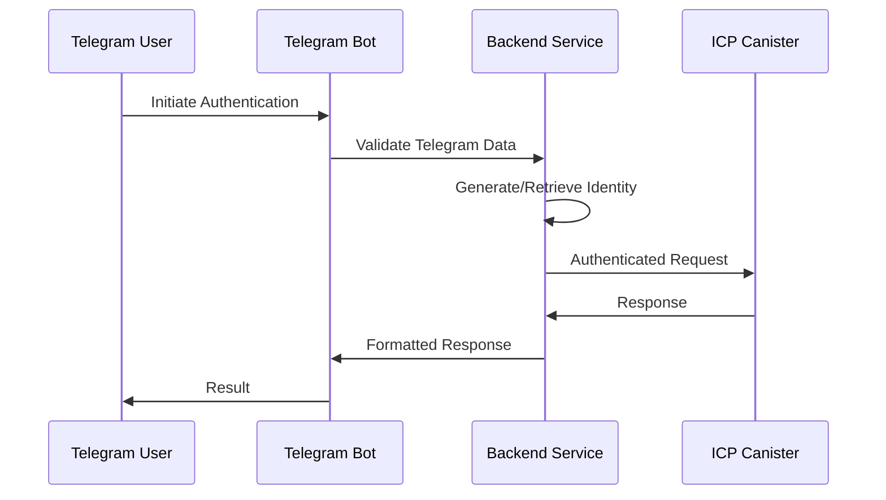

# Security Considerations for SIWT (Sign In With Telegram)

## Overview

SIWT (Sign In With Telegram) provides a secure authentication mechanism for Telegram users. This document outlines the security considerations, best practices, and implementation guidelines to ensure the integrity and safety of the authentication process.

## Key Security Differences from SIWB/SIWE

### 1. No Message Signing Capability

Unlike SIWB (Sign In With Bitcoin) or SIWE (Sign In With Ethereum), SIWT cannot rely on message signing because:
- Telegram bots run in a sandboxed environment
- Users cannot directly sign messages through Telegram's interface
- No direct access to cryptographic wallet functions

### 2. Alternative Security Model

SIWT implements a different security approach:
```
Telegram ID → Random Generated Identity → Backend Validation → Canister Access
```

## Authentication Flow Security fr

### 1. Identity Generation for Ownership Identity
- **Random Identity Creation**: Each Telegram user gets a unique, randomly generated identity
- **No Predictable Patterns**: Identities are cryptographically secure and cannot be guessed
- **One-to-One Mapping**: Each Telegram ID maps to exactly one identity

### 2. Backend Access Control
- **Private Canister Access**: Canisters are configured for private access only
- **Principal Restriction**: Only specific principals can call canister methods
- **Backend Mediation**: All user requests must go through the backend validation layer

## Security Architecture

### 1. Multi-Layer Validation



### 2. Data Validation Process

#### Telegram Data Verification
- **Hash Validation**: Verify the hash parameter against computed HMAC-SHA256
- **Timestamp Check**: Ensure auth_date is within acceptable time window (default: 24 hours)
- **Bot Token Verification**: Use bot token as the secret key for HMAC computation
- **Data Integrity**: Validate all required fields are present and properly formatted

#### Example Validation (Conceptual)
```javascript
/**
 * Validates Telegram authentication data
 * @param {Object} data - Telegram auth data object
 * @param {number} data.id - User ID
 * @param {string} data.first_name - User's first name
 * @param {number} data.auth_date - Authentication timestamp
 * @param {string} data.hash - HMAC signature
 * @param {string} [data.last_name] - User's last name (optional)
 * @param {string} [data.photo_url] - User's photo URL (optional)
 * @param {string} [data.username] - Username (optional)
 * @param {string} botToken - Telegram bot token
 * @returns {boolean} True if authentication is valid
 */
function validateTelegramAuth(data, botToken) {
  const crypto = require('crypto');
  
  // 1. Check timestamp freshness
  const currentTime = Math.floor(Date.now() / 1000);
  if (currentTime - data.auth_date > 86400) { // 24 hours
    throw new Error('Authentication data expired');
  }
  
  // 2. Verify HMAC signature
  const secretKey = crypto.createHash('sha256').update(botToken).digest();
  const dataCheckString = Object.keys(data)
    .filter(key => key !== 'hash')
    .sort()
    .map(key => `${key}=${data[key]}`)
    .join('\n');
  
  const computedHash = crypto
    .createHmac('sha256', secretKey)
    .update(dataCheckString)
    .digest('hex');
  
  return computedHash === data.hash;
}
```

## Access Control Mechanisms

### 1. Canister-Level Security
- **Private Deployment**: Canisters are deployed with private access controls
- **Principal Whitelist**: Only authorized principals can invoke canister methods
- **Method-Level Permissions**: Different methods may have different access requirements

### 2. Backend Security
- **Environment Variables**: Store sensitive data (bot tokens, secrets) in environment variables
- **Rate Limiting**: Implement rate limiting to prevent abuse
- **Request Validation**: Validate all incoming requests before processing
- **Logging**: Maintain audit logs for security monitoring

## Data Protection

### 1. Sensitive Data Handling
- **No Storage of Bot Tokens**: Bot tokens should never be stored in databases
- **Minimal Data Collection**: Only collect necessary user information
- **Data Encryption**: Encrypt sensitive data at rest and in transit
- **Secure Transmission**: Use HTTPS for all communications

### 2. User Privacy
- **Consent Management**: Clearly communicate what data is collected and why
- **Data Minimization**: Collect only the minimum required user information
- **Retention Policies**: Implement appropriate data retention and deletion policies

## Common Security Vulnerabilities and Mitigations

### 1. Replay Attacks
**Risk**: Reusing authentication data
**Mitigation**: 
- Implement timestamp validation
- Use nonces for one-time authentication
- Set short expiration times for auth data

### 2. Man-in-the-Middle Attacks
**Risk**: Interception of authentication data
**Mitigation**:
- Enforce HTTPS/TLS for all communications
- Implement certificate pinning where possible
- Validate SSL certificates

### 3. Bot Token Exposure
**Risk**: Unauthorized access to bot functionality
**Mitigation**:
- Store bot tokens securely (environment variables, secret managers)
- Rotate bot tokens regularly
- Monitor for unauthorized bot usage
- Implement bot token validation

### 4. Identity Spoofing
**Risk**: Impersonation of legitimate users
**Mitigation**:
- Strict validation of Telegram authentication data
- Cross-reference user data with Telegram's servers when possible
- Implement additional verification steps for sensitive operations

## Implementation Best Practices

### 1. Error Handling
- **Generic Error Messages**: Don't expose internal system details in error messages
- **Logging**: Log security events for monitoring and analysis
- **Graceful Degradation**: Handle authentication failures gracefully

### 2. Monitoring and Alerting
- **Failed Authentication Attempts**: Monitor and alert on suspicious patterns
- **Rate Limiting Triggers**: Alert when rate limits are exceeded
- **Unusual Access Patterns**: Detect and investigate anomalous behavior

### 3. Regular Security Reviews
- **Code Audits**: Regular security code reviews
- **Dependency Updates**: Keep all dependencies up to date
- **Penetration Testing**: Regular security testing
- **Vulnerability Scanning**: Automated security scanning

## Compliance and Standards

### 1. Applicable Standards
- **OWASP Guidelines**: Follow OWASP security best practices
- **Data Protection**: Comply with GDPR, CCPA, and other applicable regulations
- **Industry Standards**: Adhere to relevant industry security standards

### 2. Regular Audits
- **Internal Audits**: Regular internal security assessments
- **External Audits**: Periodic third-party security audits
- **Compliance Checks**: Regular compliance verification

## Conclusion

SIWT provides a secure authentication mechanism while acknowledging the unique constraints of the Telegram platform. By implementing proper validation, access controls, and monitoring, SIWT can provide robust security for user authentication and authorization.

For questions or concerns about security, please refer to our [Contributing Guidelines](CONTRIBUTING.md) or contact our security team.

---