# SIWT Architecture Diagram

This document contains the architecture diagram for Sign In With Telegram (SIWT) on the Internet Computer.

## Authentication Flow Sequence Diagram

```mermaid
sequenceDiagram
    participant User as 👤 User
    participant TG as 📱 Telegram WebApp
    participant Frontend as 🌐 Frontend App
    participant SIWT as 🔐 SIWT Canister
    participant IC as ⚡ Internet Computer
    participant Target as 🎯 Target Canister

    Note over User, Target: SIWT Authentication Flow

    %% Step 1: User initiates login
    User->>Frontend: Click "Sign in with Telegram"
    Frontend->>TG: Open Telegram WebApp
    
    %% Step 2: Telegram authentication
    TG->>User: Request authentication
    User->>TG: Approve login
    TG->>Frontend: Return initData with hash
    
    Note over TG, Frontend: initData contains: user_id, first_name, username, auth_date, hash
    
    %% Step 3: Prepare delegation request
    Frontend->>SIWT: prepare_delegation(initData, canisters[])
    SIWT->>SIWT: Validate Telegram hash
    SIWT->>SIWT: Generate session key
    SIWT->>Frontend: Return session_key & expiration
    
    %% Step 4: User signs the delegation
    Frontend->>User: Request signature for delegation
    User->>Frontend: Sign delegation with session key
    
    %% Step 5: Complete authentication
    Frontend->>SIWT: login(signed_delegation)
    SIWT->>SIWT: Verify signature
    SIWT->>SIWT: Create delegation chain
    SIWT->>Frontend: Return delegation & identity
    
    %% Step 6: Use authenticated identity
    Frontend->>Target: Call canister method with delegation
    Target->>IC: Verify delegation chain
    IC->>Target: Confirm caller identity
    Target->>Frontend: Return authorized response
    Frontend->>User: Display authenticated content
    
    Note over User, Target: User is now authenticated and can access protected resources
```

## Key Components

### 1. Telegram WebApp
- Provides user authentication through Telegram's OAuth flow
- Returns `initData` containing user information and cryptographic hash
- Ensures user owns the Telegram account

### 2. SIWT Canister
- Validates Telegram authentication data
- Generates Internet Computer delegation chains
- Manages session keys and expiration times
- Acts as identity provider for IC ecosystem

### 3. Frontend Application
- Orchestrates the authentication flow
- Handles user interactions and UI updates
- Manages delegation storage and usage
- Communicates with both Telegram and IC canisters

### 4. Target Canister
- The application canister requiring authentication
- Verifies delegation chains through IC infrastructure
- Provides authorized access to protected resources

## Security Considerations

1. **Telegram Hash Validation**: SIWT canister cryptographically verifies the Telegram `initData` hash
2. **Delegation Expiration**: All delegations have configurable expiration times
3. **Session Management**: Temporary session keys prevent long-term key exposure
4. **Canister Restrictions**: Delegations can be scoped to specific canisters
5. **No Private Key Storage**: User private keys never leave the frontend

## Data Flow

## Integration Points

- **Telegram Bot API**: For hash validation and user data verification
- **Internet Computer**: For delegation chain creation and verification
- **Frontend SDKs**: For seamless integration with web applications
- **Canister APIs**: For protected resource access